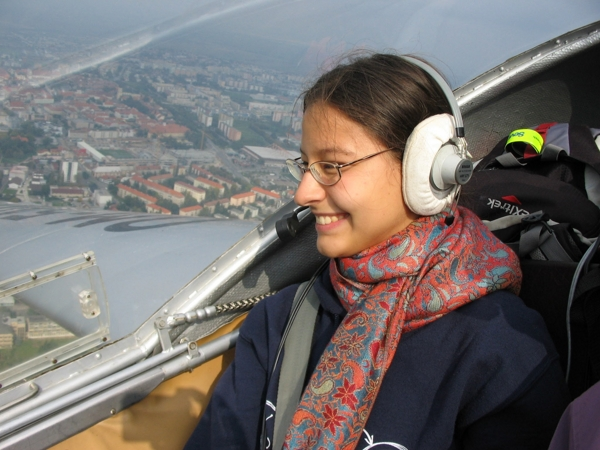

<figure class="figure float-right ml-1">
  
  <figcaption class="figure-caption text-right">Flying a <a href="http://www.airplane-pictures.net/type.php?p=739">Vivat motor glider</a> over Trnava, Slovakia, with a huge smile.</figcaption>
</figure>

I am a computer science student at [ETH Zurich](https://www.ethz.ch/) (specializing on information security and distributed systems). I also aspire to be a lot of other things, such as:

- **a scientist**, in thinking if not in profession, because the world is complicated and wonderfully interesting
- **a flutist**, because music feels like it comes from a better world
- **a pilot**, because when in the sky, all the troubles of daily life are left far below
- **[an artist](/making)**, because making things is great
- **a helpful person**, because despite being a little afraid of people, I like <strike>them</strike> you!

I have become Christian and [here are 5 sentences about that](/christian).

You might be looking for:
------------------------

- [my coding projects](/coding)
- [my CV](/cv)
- [my calendar](/busy)

